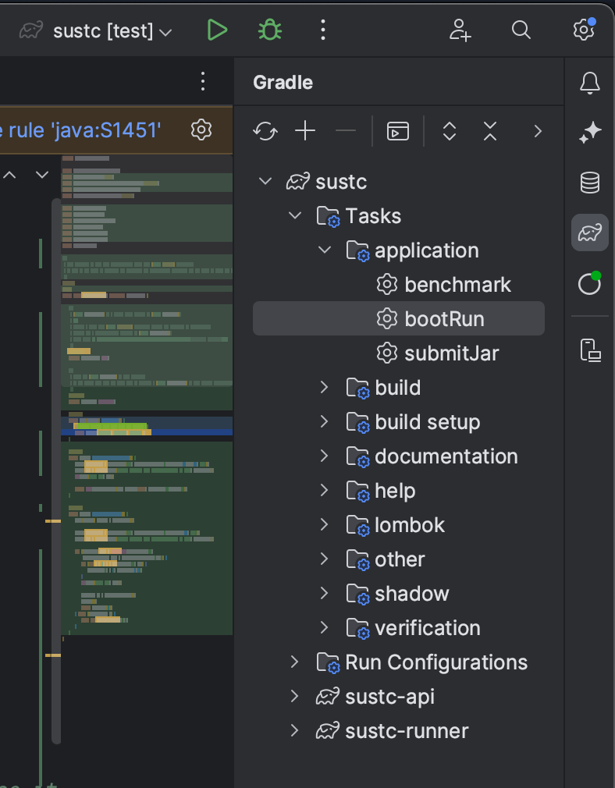

# 📺 SUSTech Database System Project 2


This project is about the structure of a publication management system named Scholarly Universe System to Check (SUSTC), which is similar to Google Scholar. The provided data contains basic information about articles, and it is complete (that is, all the cited articles of an article can be found in the provided data). The data is an excerpt of the full NIH NLM PubMed 2024 Baseline. For those who are curious about the pre-processing step which leads to this dataset, see scripts [here](https://github.com/Ray-Eldath/db24fall/tree/master).

## Prerequisites

- **JDK**: This template requires JDK 8+ and is compatible up to Java 20. We will use _JDK 20_ to work around your
  submitted jar file.

  > Other JVM languages (Kotlin, Groovy) are supported as long as you build a jar file that can pass the local
  benchmark.

- **Database**: You need to host your own PostgreSQL database when developing. We will use _PostgreSQL 16_ to run
  the final benchmark.


## Getting started


### 1. Understand the project structure

<details>
<summary><b>Expand this section to see the sample code tree</b></summary>
<pre>
.
├── sustc-api                                              # You should work around this directory
│   ├── build.gradle.kts                                   # You may add any utility libraries here
│   └── src/main/java
│                └── io.pubmed
│                    ├── dto                               # The passed arguments and return values of services are defined as DTO (Data Transfer Object)
│                    │   └... Article.java                    # You should not modify the defined fields or methods, but you may add new ones
│                    └── service                           # The interfaces of services are defined here
│                        ├... DatabaseService.java
│                        └── impl                          # We suggest you to place your implementation here. Actually, any package is OK, as long as annotating the class as `@Service`
│                            └... DatabaseServiceImpl.java
└── sustc-runner                                           # We've provided you an interactive command line runner, a benchmark runner with sample data, and unit tests
    ├── compose.yml                                        # You may optionally use a container-based database to prevent polluting your local database
    ├── data                                               # Contains records to import and test cases
    └── src/main
            ├── java
            │   └── io.pubmed
            │       └── command                            # You may call the services here, type `help` in shell to list all commands
            │           └... DatabaseCommand.java
            └── resources
                └── application.yml                        # Configure your database connection and benchmark behavior here
</pre>

You don't need to care about the unlisted files and directories.
</details>

The project is managed by Gradle to help you manage dependencies, run locally, and build the submission.

- [`sustc-api`](sustc-api) is the module where you should implement your services.
- [`sustc-runner`](sustc-runner) module provides you an interactive command line runner and a benchmark runner with sample data.

Basically, you only need to focus on three directories:

1. [`io.pubmed.service`](sustc-api/src/main/java/io/pubmed/service) package contains the interfaces of services you
   need to implement. You
   should not modify the interfaces.
   - A demo implementation is provided in
   [`DatabaseServiceImpl`](sustc-api/src/main/java/io/pubmed/service/impl/DatabaseServiceImpl.java).
   **Please also update the `getGroupMembers` method to help us identify your submission.**
   - We also provide **a standard data-importing script [`GoodLoader`](sustc-api/src/main/java/io/pubmed/service/impl/GoodLoader.java)** that loads the data file `pubmed24n.ndjson` into the given database, **using this script can guarantee your local database will be *identical* to what we use when judging your submission.** You can also make modifications so that the script suits your own schema. Make sure to change L250-L255 to your connection credential:
      ```java
      // change L250-L255 in GoodLoader.java to your own connection credential
      fileName = "D:\\study\\2024F\\SA\\Database\\cs201_project2_import\\src\\main\\java\\org\\example\\pubmed24n.ndjson";
      Properties properties = new Properties();
      properties.put("host", "localhost");
      properties.put("user", "postgres");
      properties.put("password", "wsljr1222999");
      properties.put("database", "postgres");
      ```

2. [`io.pubmed.dto`](sustc-api/src/main/java/io/pubmed/dto) package contains the definitions of DTOs (Data Transfer
   Objects) that act as the arguments and return values of services. You should not modify the defined fields or
   methods, but you may add new ones.

3. [`application.yml`](sustc-runner/src/main/resources/application.yml) is the configuration file for running the
   program. You may configure your database connection and benchmark behavior here.

Please note that your submission is built by the `sustc-api` module, any modification to the `sustc-runner` module will
not take effect in the final benchmark.

### 2. Run locally

After setting up your database and modifying the configuration file, you may run the program locally in two modes.

#### 2.1 Interactive shell

You can test your services by typing commands in any sequence, with any data. Run the Gradle task named **`bootRun`**
to start the interactive shell.

```shell
./gradlew :sustc-runner:bootRun  # or simply   ./gradlew bootRun
```

> If you are using IntelliJ IDEA, you may find the list of Gradle tasks on the right side of the window.
<p align="center"></p>

You may type `help` after the application starts up to see the list of available commands.

A `db gen` command is provided to generate test data from a living database and the services that you should implement. Actually, the standard answers (described below) are generated using this command against _our_ services implementation, and you may modify this command if you need to test more things out.

#### 2.2 Benchmark with sample data

[The benchmark service](sustc-runner/src/main/java/io/pubmed/benchmark/BenchmarkService.java) works exactly the same as how
we will judge your submission, which grades your services based on both correctness and performance.
To run the benchmark, use the **`benchmark`** Gradle task. 

This task will run your services with some **(not all)** test data against standard answers under folder [sustc-runner/data/test](./sustc-runner/data/test) that is generated with `db gen`. Notice that when juding your submission we have a _much larger_ test corpus.

Note that you need to implement all service interfaces to run the benchmark.
You may create dummy implementations (e.g. throw UnsupportedOperationException) before actually implementing them.

## 3. Submitting your work

#### 3.1 submit load database file

We provide a sample database initialization and loader **`impl/GoodLoader.java`**, , we use this file to build the database by default, if you need to modify or customize the database, please submit a **`.java`** file (any filename is acceptable).

#### 3.2 submit jar file
As previously mentioned, you need to submit a jar file that contains your implementation of the services
(and any dependencies you added). To build it, run the **`submitJar`** Gradle task.

```shell
./gradlew submitJar
```

Then you should find a `submit` folder under the root of project, containing a single jar file
(its size should be about 8~10 MB if you didn't add any additional dependencies).
**We don't accept jar files larger than 20 MB, so please don't add too much dependencies.**

> If any jar file presents in the `submit` folder, the runner will use it
> instead of the latest code in `sustc-api` module.


```text
submit              # Under the root of project
├── loader.java (optional)      # Any filename is acceptable
└── sustc-api.jar   # Produced by `submitJar` task
```

Then zip the `submit` folder (unzip should produce a folder named `submit`, instead of any other folder name).

Also, similar to other courses, we require you to submit your source code for academic purposes and plagiarism detection. Please run the `clean` task before archiving your source code, which will delete the built files.

```shell
./gradlew clean
```

After cleaning up, the source archive of __sustc-api__ should not be larger than 10 MB.

Finally, upload these zip files with any other resources as specified to Blackboard.

## More Information

Please also read the project requirements document posted on [Blackboard](https://bb.sustech.edu.cn).


## Useful links

- [PostgreSQL 16 Documentation](https://www.postgresql.org/docs/16/index.html)
   - [Backward Compatibility](https://www.postgresql.org/docs/16/runtime-config-compatible.html)
- [SpringBoot 2.7 Documentation](https://docs.spring.io/spring-boot/docs/2.7.16/reference/htmlsingle/)
- [Lombok Documentation](https://projectlombok.org/features/)
- [Gradle User Manual](https://docs.gradle.org/8.3/userguide/userguide.html)
   - [Managing dependencies with Gradle](https://www.baeldung.com/gradle#plugins)
